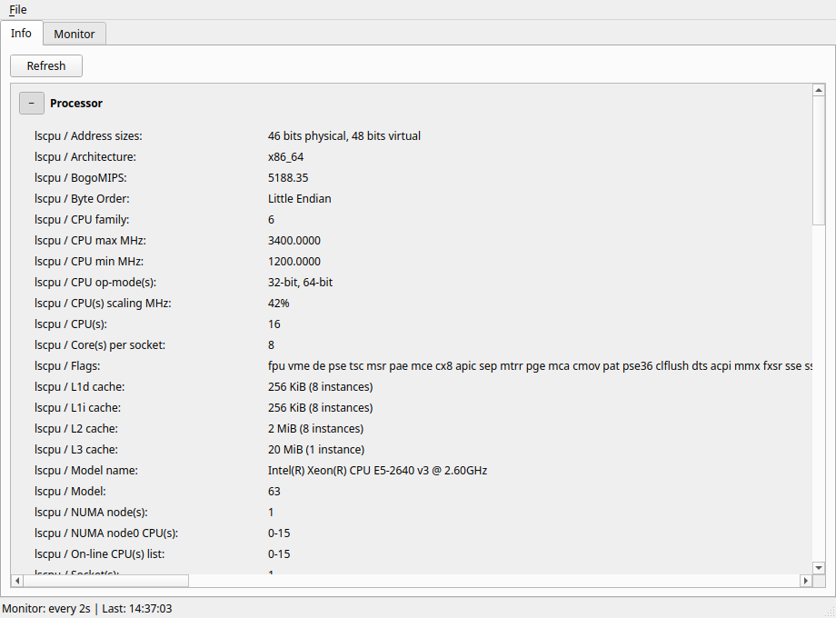
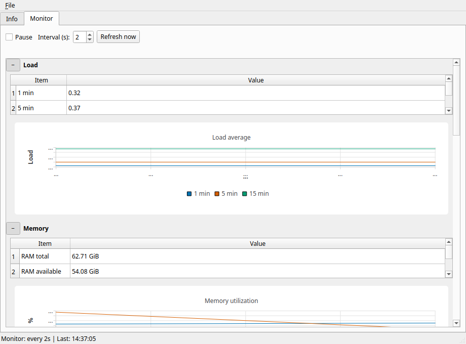

# lhwmonitor

Hardware Information and Monitor Tool for Linux

**Version: v0.2.2**

Linux-only desktop app with an **Info** tab (static hardware identification, CPU-Z–style) and a **Monitor** tab (live sensors and usage, HWMonitor–style). The Monitor tab includes **rolling line charts** (Qt Charts) for load, system/GPU memory use, CPU usage, temperatures, selected sensor temperatures, and CPU frequency, alongside the existing tables. **Graphics** on the Info tab includes **GPU VRAM** (and shared/dynamic memory when the driver reports it) when NVIDIA or AMD tools are available.

Development phases from first release through the current version are summarized in [PROJECT_HISTORY.md](PROJECT_HISTORY.md).

## Screenshots

Captured on Linux with the offscreen Qt platform (see [`scripts/capture_screenshots.py`](scripts/capture_screenshots.py)); your layout and values will depend on hardware and theme. PNGs live in [`screenshots/`](screenshots/).

### Info tab



### Monitor tab



### Saving a snapshot (manual export)

Use **File → Save snapshot…** (or **Ctrl+S**) to write the current **Info** bundle and **Monitor** snapshot to a file. Choose **JSON** for full structured data (good for scripts and archival) or **CSV** for spreadsheets (flattened rows with `Section`, `Item`, `Value`). This is a **manual** export only; **automatic / continuous logging** may be added in a future version.

## Requirements

- Python 3.11+
- PySide6 (installed automatically via pip)
- Optional but recommended: **lm-sensors** (`sensors`, `sensors-detect`) for temperature and fan data
- Optional: **dmidecode** (often needs root) for motherboard/BIOS strings on the Info tab
- **pciutils** (`lspci`) for GPU listing

## Install (development)

On some Linux distributions (notably Debian and Ubuntu), the `venv` module is shipped separately. If `python3 -m venv` fails (often mentioning `ensurepip` or `venv`), install **python3-venv** first—for example: `sudo apt install python3-venv`.

```bash
cd lhwmonitor
python -m venv .venv
source .venv/bin/activate
pip install -e ".[dev]"
```

## Run

```bash
lhwmonitor
# or
python -m lhwmonitor
```

### Running with `sudo` (DMI and PATH)

Motherboard/BIOS details from **dmidecode** usually require root. If you run `sudo lhwmonitor` and see **command not found**, `sudo` resets `PATH` and no longer sees a venv or `~/.local/bin` install. Use either:

```bash
sudo env PATH="$PATH" lhwmonitor
# or
sudo "$(command -v lhwmonitor)"
```

## License

Licensed under the [MIT License](LICENSE).
